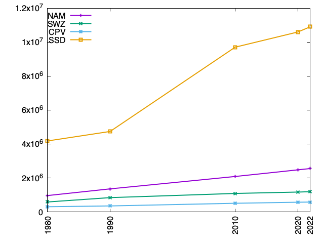

# Visualization 
## Installation
Ubuntu
```bash
sudo apt install gnuplot
```

## Reference
[Official demo](https://gnuplot.sourceforge.net/demo/)


## First Plot

`$ gnuplot` initiates the gnuplot window.


```bash
gnuplot> plot sin(x)
```

## Scripting
You can create a script file including multiple gnuplot commands, instead of using the interactive command window. The script file is a simple text file. (A typical extension is `.plt`)

When you execute the script file, use the `load` command.

```bash
gnuplot> load 'script.plt'
```

## Basic Plot Settings
Note: You can write the following in the script file.

```bash
gnuplot> set term dumb
```

```bash
gnuplot> set term pngcairo
gnuplot> set out "filename.png"
```

```bash
gnuplot> set xr[0:1]    # 0<=x<=1
gnuplot> set yr[-1:1]   # -1<=y<=1
```

```bash
gnuplot> set size 0.6, 0.4    # 0.6*(width) and 0.4*(height)
```

```bash
gnuplot> set xlabel "time"
gnuplot> set ylabel "volume"
```


```bash
gnuplot> set xtics 2      # Control of the major (labelled) tics on the x axis
gnuplot> set mxtics 5     # Minor tic marks along the x axis
```

## Examples
- Scatter plot
- Histogram
- Box Plot

## Case Study: Population
Using the `world_population.csv` data set, plot the population in a few countries in 1980, 1990, 2010, 2020, and 2022.

For a line plot, you can use a command like this:
```bash
plot 'population-data.dat' using 1:2 w lp lw 2 title "NAM"
```

You can clean up and reshape the dataset using AWK. (The cleaned data set is called `population-data.dat`.)

Here is a plot example.



